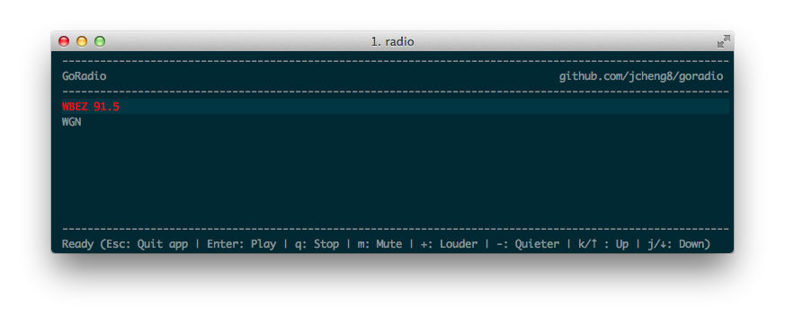

**GoRadio** is a terminal based internal radio player written in golang. It's my first go project and heavily borrowed from coderholic's pyradio [https://github.com/coderholic/pyradio]() Termbox-go is used for the interface instead of curse.

**Usage**

Create a file 'stations' under ~/.goradio/. One station per line and comma separate the name and stream url.

**Example of 'stations' file:**

   WBEZ 91.5, http://stream.wbez.org/wbez128.mp3
   
   WGN, http://provisioning.streamtheworld.com/pls/WGNPLUSAM.pls
   
**Keyboard**

*    k or arrow up: Move up in stations selection
*    j or arrow down: Move down in stations selection
*    Enter: Play selected station
*    m: Mute
*    q: Stop
*    +: Turn up the volume
*    -: Turn down the volume
*    Esc: Quit the app

**Screenshot**

